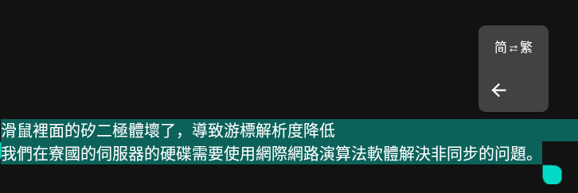

# ZhConvert

Convert ZH language is any place with a action bubble.

Install the apk file right from [Releases](https://github.com/L-Ryland/ZhConvert/releases), and you can find this button anywhere in a `TextView` :)

